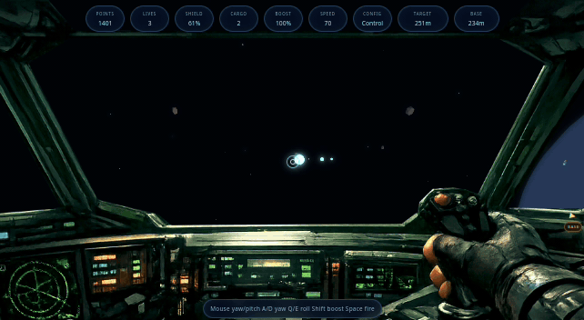

# Aster3D

A browser-based game inspired by **Asteroids**, but in **3D** with a spaceship cockpit view.

[](https://volter2pl.github.io/aster3d/)

<a href="https://volter2pl.github.io/aster3d/">
  
</a>

---

## Gameplay

Fly through open space, destroy asteroids and enemy ships, and collect salvage.

Salvage can be found drifting in space or dropped after destroying an asteroid or an enemy ship. Bring it back to the base to sell it for points.

The base is also your safe point: you can dock there to repair shields before heading back out.

---

## Controls

| Key | Action |
|--------|------|
| Click | activate pointer lock |
| Mouse | look around / aim |
| Arrow keys | pitch / yaw |
| W / S | forward thrust / braking |
| A / D | yaw |
| Shift | boost |
| Space | shoot |
| R | restart after game over |

---

## Stack

- Babylon.js
- TypeScript
- Vite

---

## Run

```bash
npm install
npm run dev
```

Production build:

```bash
npm run build
```
